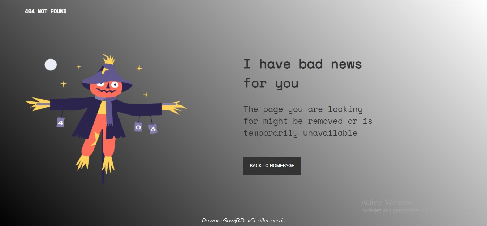
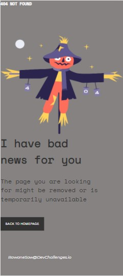

<!-- Please update value in the {}  -->

<h1 align="center">404 NO FOUND Page</h1>

   Solution for a challenge from  <a href="http://devchallenges.io" target="_blank">Devchallenges.io</a>.

  <h3>
    <a href="https://404pagechallenge.netlify.app/">
      Demo
    </a>
     | 
    <a href="file:///C:/Users/user/Desktop/Projects/404%20Page/404%20Page.html">
      Solution
    </a>
     | 
    <a href="https://devchallenges.io/challenges/wBunSb7FPrIepJZAg0sY">
      Challenge
    </a>
  </h3>

<!-- TABLE OF CONTENTS -->

## Table of Contents

- [Overview](#overview)
  - [Built With](#built-with)
- [Features](#features)
- [Contact](#contact)
- [Acknowledgements](#acknowledgements)

<!-- OVERVIEW -->

## Overview

Introduce your projects by taking a screenshot or a gif. Try to tell visitors a story about your project by answering:

- My demo can be seen here : 

### Built With

<!-- This section should list any major frameworks that you built your project using. Here are a few examples.-->
I've built this project with only HTML and CSS.
## Features

<!-- List the features of your application or follow the template. Don't share the figma file here :) -->

This application/site was created as a submission to a [DevChallenges](https://devchallenges.io/challenges) challenge. The [challenge](https://devchallenges.io/challenges/wBunSb7FPrIepJZAg0sY) was to build an application to complete the given user stories.

## Acknowledgements

<!-- This section should list any articles or add-ons/plugins that helps you to complete the project. This is optional but it will help you in the future. For exmpale -->

- [Steps to replicate a design with only HTML and CSS](https://devchallenges-blogs.web.app/how-to-replicate-design/)

## Contact

- Website [My Site](https://404pagechallenge.netlify.app/)
- GitHub [Full-Dingue](https://github.com/Full-Dingue/404-Page-Challenge)
- Twitter [El Hadji Rawane Meissa](https://twitter.com/hadji_meissa)
